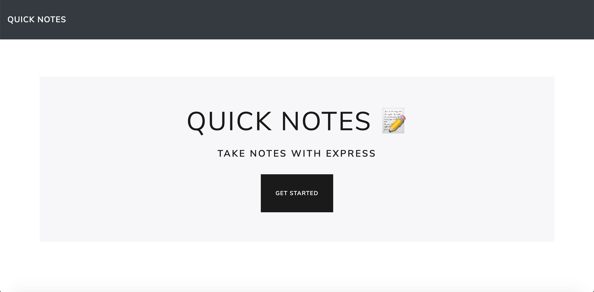
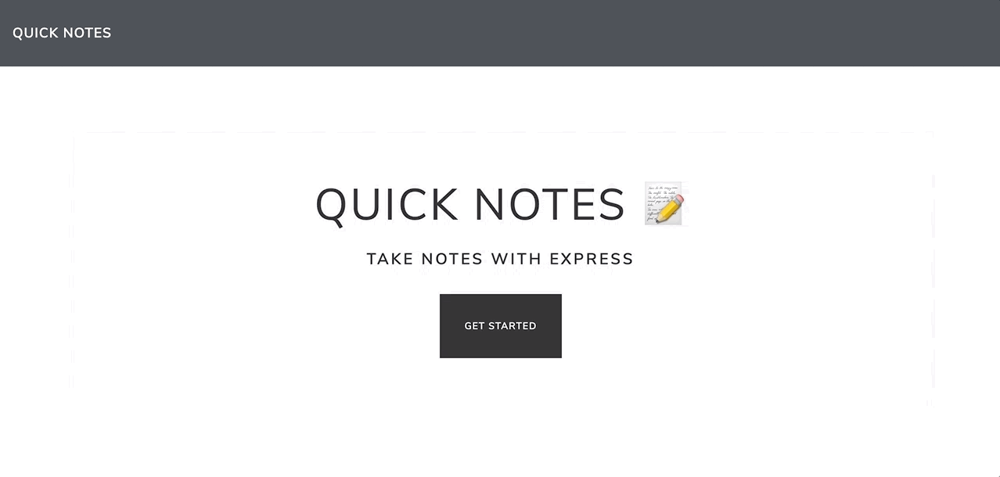

# QuickNotes

## Demonstration

## Table of Contents
* [Description](#description)
* [Installation](#installation)
* [Use](#use)
* [Licensing](#licensing)
* [Contributors](#contributors)
* [Contributing](#contributing)
* [Github](#github) 

## Description
An online notes application to store and retrieve notes from a local database. Uses express to get, post, and delete information from a JSON file.
 
## Installation
1. Go to [https://github.com/timothymickiewicz/QuickNotes] and clone this repository.
2. Open terminal and paste the clone URL into the location where you want this repository.
3. Open this application's directory in your terminal and run `npm install` to install dependancies.
4. Run `nodemon server.js` to start the local server.
5. Open this application at [http://localhost:3000/] in your browser of choice. Google Chrome is suggested.

## Use
This application is intended to be used for quick and easy access to notes on your desktop or laptop computer. Notes can be made, re-visited, and deleted from the user interface.
 
## Licensing

 
## Contributors
Timothy Mickiewicz
* (shields.io) 
* (contributor-covenant.org)
 
## Contributing
 
Please note that this project is released with a Contributor Code of Conduct. By participating in this project you agree to abide by its terms. 
https://www.contributor-covenant.org/version/2/0/code_of_conduct/
 
## Contact
 
timothy.mickiewicz@gmail.com